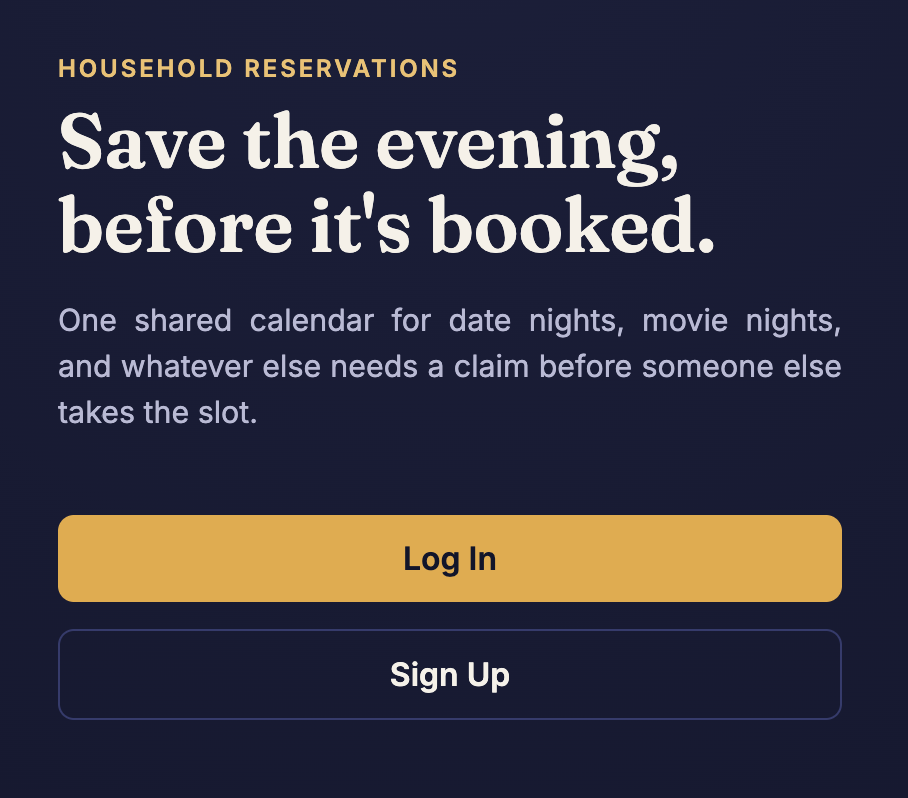
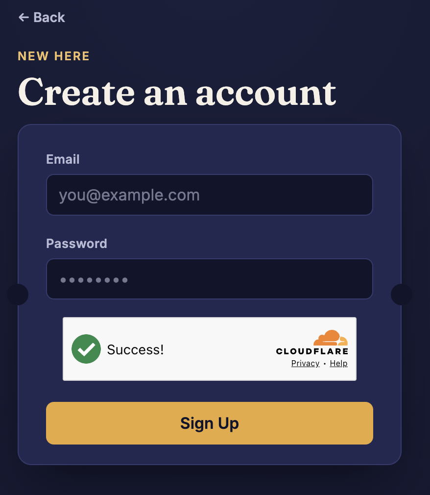
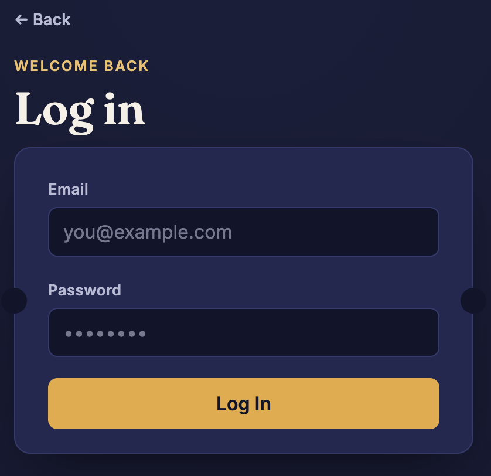
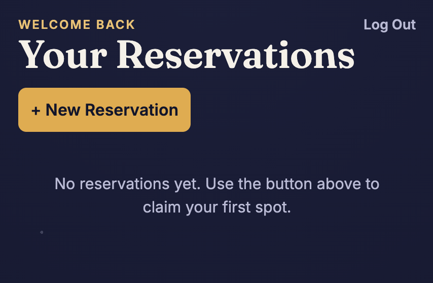
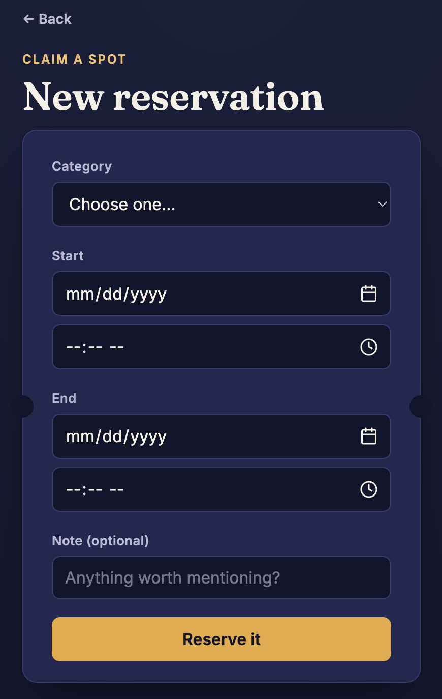
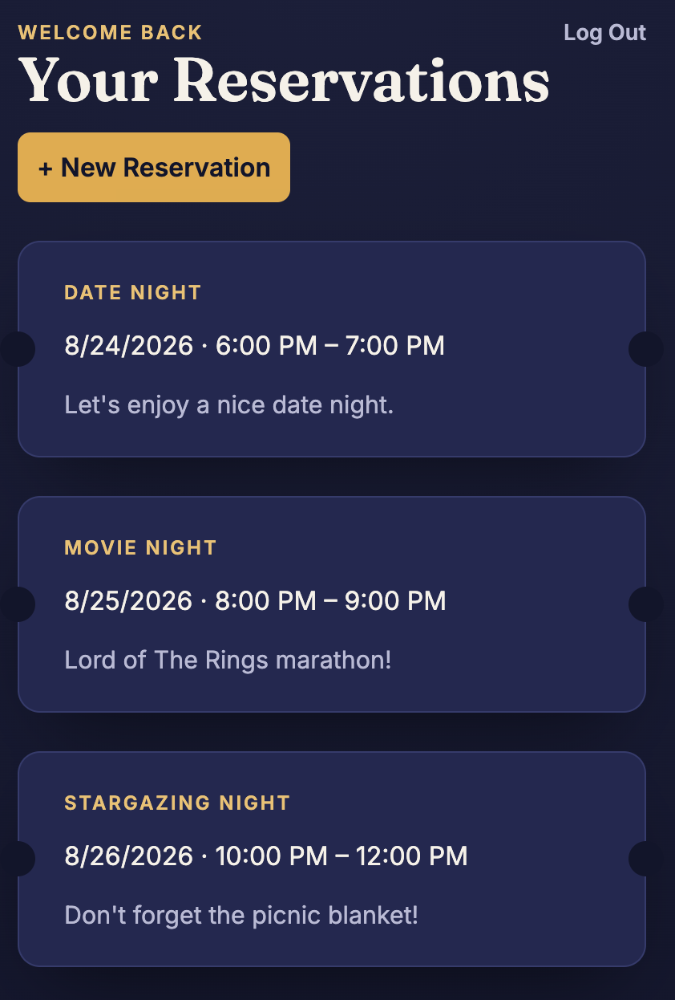

# Reservation API

A REST API for managing household reservations — think a shared calendar for "Date Night," "Movie Night," or whatever else two people need to coordinate around. Built from scratch in Go, backed by PostgreSQL, with full auth, role-based admin actions, conflict detection, and email notifications — plus a small themed front end for actually using it.

This is a personal project — no live deployment, runs locally.

---

## Features

- **Auth** — signup, login, JWT access + refresh tokens, role-based claims
- **Reservations** — full CRUD, with server-side overlap detection to prevent double-booking a category
- **Categories** — admin-managed, soft-delete via active/inactive toggle (never hard-deleted, so reservation history stays intact)
- **Admin tooling** — role promotion, cancel any reservation, audit logging on admin actions
- **CAPTCHA** — Cloudflare Turnstile verification on signup
- **Email notifications** — signup confirmation, reservation created, reservation cancelled — sent asynchronously via [Resend](https://resend.com)
- **CORS + timeouts** — configured for a known front-end origin, with server-side timeouts to prevent resource exhaustion

---

## Screenshots

A small themed front end (`index.html`) walks through the full user flow — no framework, just HTML/CSS/JS talking directly to the API.

<table>
<tr>
<td><strong>Landing page</strong><br></td>
<td><strong>Sign up (Turnstile CAPTCHA)</strong><br></td>
</tr>
<tr>
<td><strong>Log in</strong><br></td>
<td><strong>Dashboard — no reservations yet</strong><br></td>
</tr>
<tr>
<td><strong>Creating a reservation</strong><br></td>
<td><strong>Dashboard — real reservations</strong><br></td>
</tr>
</table>

---

## Tech Stack

| Layer      | Tool                                                         |
| ---------- | ------------------------------------------------------------ |
| Language   | Go (standard library `net/http`, no framework)               |
| Database   | PostgreSQL                                                   |
| Migrations | [Goose](https://github.com/pressly/goose)                    |
| Queries    | [SQLC](https://sqlc.dev) (type-safe, generated from raw SQL) |
| Auth       | JWT (`golang-jwt`), Argon2id password hashing                |
| CAPTCHA    | Cloudflare Turnstile                                         |
| Email      | Resend                                                       |
| CORS       | [rs/cors](https://github.com/rs/cors)                        |

---

## Project Structure

```
.
├── index.html            # front end — landing, auth, dashboard, reservations
├── main.go               # server setup, routing, config
├── users.go              # signup, profile, role management
├── login.go              # login handler
├── tokens.go              # refresh / revoke
├── categories.go          # category CRUD + admin actions
├── reservations.go        # reservation CRUD, conflict detection
├── middleware.go           # admin-only route middleware
├── captcha.go              # Turnstile verification
├── mailer.go                # transactional email sending
├── json.go                  # response helpers
├── internal/
│   ├── auth/                  # password hashing, JWT, bearer token parsing
│   └── database/               # SQLC-generated query code
└── sql/
    ├── schema/                   # Goose migrations
    └── queries/                   # hand-written SQL, source for SQLC
```

---

## API Overview

All routes are prefixed `/api/v1`. Admin-only routes additionally live under `/api/v1/admin`.

| Method  | Path                            | Description                                     |
| ------- | ------------------------------- | ----------------------------------------------- |
| `POST`  | `/users`                        | Create an account (CAPTCHA required)            |
| `POST`  | `/login`                        | Log in, receive access + refresh tokens         |
| `POST`  | `/refresh`                      | Exchange a refresh token for a new access token |
| `POST`  | `/revoke`                       | Revoke a refresh token                          |
| `GET`   | `/categories`                   | List active categories                          |
| `POST`  | `/categories`                   | Create a category _(admin)_                     |
| `POST`  | `/reservations`                 | Create a reservation                            |
| `GET`   | `/reservations`                 | List your own reservations                      |
| `PATCH` | `/reservations/{id}`            | Cancel your own reservation                     |
| `GET`   | `/admin/reservations`           | List all reservations _(admin)_                 |
| `PATCH` | `/admin/reservations/{id}`      | Cancel any reservation _(admin, logged)_        |
| `PATCH` | `/admin/categories/{id}`        | Rename a category _(admin)_                     |
| `PATCH` | `/admin/categories/{id}/active` | Activate/deactivate a category _(admin)_        |
| `PATCH` | `/admin/users/{id}`             | Change a user's role _(admin)_                  |

---

## Design Notes

A few decisions worth calling out, since they weren't defaults — they were chosen deliberately:

- **Soft deletes everywhere.** Categories and reservations are never hard-deleted; foreign keys use `ON DELETE RESTRICT` to guarantee history can't silently disappear. `refresh_tokens`, by contrast, use `ON DELETE CASCADE` — a revoked or expired token has no historical value once its owner is gone.
- **Conflict detection.** Reservations are checked for time-overlap within the same category before creation, using a database-level `EXISTS` query rather than fetching and comparing in application code.
- **Audit logging.** Admin actions that affect another user's data (like cancelling their reservation) are logged to a dedicated table, separate from application logs — an audit trail answers "who did what," while logs are for debugging.
- **Async email.** Notifications are sent in a goroutine so a slow email provider never blocks the API response.

---

## Status

Backend feature-complete, front end covers the full core user flow (signup → login → view/create reservations → logout). No deployment yet — everything runs locally.

**Known gaps, on the list:**

- No cancel button in the dashboard yet — the backend endpoint exists and is tested, just not wired up in the UI
- Time input UX is inconsistent across browsers (a native `<input type="time">` limitation, not fully resolved)
